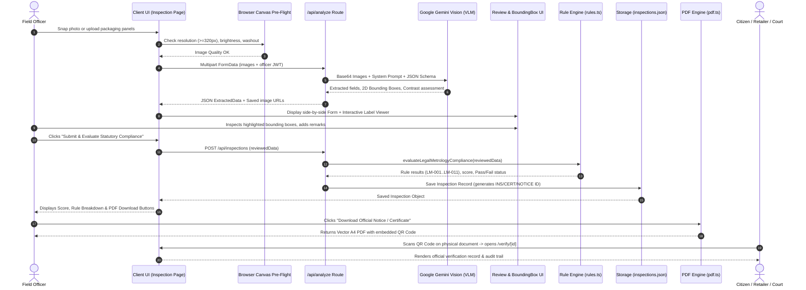

# MetrologyAI — Packaging Compliance Inspection System

---

## 1. What is this Project About?

**MetrologyAI** is an AI-powered regulatory enforcement platform built for **Legal Metrology Officers and FMCG Quality Directors** under the **Legal Metrology Act, 2009** and the **Legal Metrology (Packaged Commodities) Rules, 2011 (LMPC Rules)** in India.

### The Problem it Solves
Packaged commodities (food, cosmetics, electronics, pharmaceuticals, daily goods) sold in physical markets and e-commerce warehouses are legally mandated to declare specific information on their packaging (such as MRP with inclusive taxes, Net Quantity in standard metric units, Date of Manufacture/Packing, Expiry/Use-by, Batch number, Country of Origin, Manufacturer/Packer/Importer complete postal addresses with PIN code, and Consumer Care helpline/email).

Traditionally:
- Inspectors had to **manually read tiny fonts**, calculate font size ratios, check address completeness, and physically draft legal notices.
- Audits were **slow, subjective, error-prone**, and difficult to defend during compounding hearings or court challenges.
- Manufacturers risked **costly product recalls** and penalties due to subtle labeling oversights (like non-contrasting MRP numbers, missing PIN codes, or illegal units like "gms" instead of "g").

### The Solution
**MetrologyAI automates packaging inspections end-to-end**:
1. An officer photographs the packaging using a smartphone camera or uploads panel images.
2. Multimodal AI visually reads and extracts **20+ statutory declarations** with **2D bounding-box coordinates** and **color contrast assessments**.
3. A **deterministic rule engine** tests the packaging against statutory legal sections (Rule 6, Rule 9, Schedule 2, etc.).
4. The system calculates an objective compliance score (0–100%) and automatically generates a **digitally signed Certificate of Compliance** (if 100% pass) or a **Statutory Show-Cause Non-Compliance Notice** (if violations exist), complete with tamper-evident, scannable QR codes for public verification.

---

## 2. Tech Stack & Dependencies

| Layer | Technologies Used | Purpose / Role |
|---|---|---|
| **Framework** | [Next.js 16 (App Router)](file:///Users/jadavsmit/Desktop/SIH-2026/MetrologyAI_SIH26034-main/package.json) | React Server Components, Node.js API routes, dynamic rendering, route handling |
| **Frontend UI** | React 19, [Tailwind CSS v4](file:///Users/jadavsmit/Desktop/SIH-2026/MetrologyAI_SIH26034-main/package.json#L34), Lucide React | High-performance, modern, mobile-responsive field officer interface |
| **Language** | TypeScript 5 | End-to-end type safety across inspections, extraction schemas, and rules |
| **AI / Multimodal Vision** | `@google/genai` (Google GenAI SDK) | Google Gemini Vision Models (`gemini-3.6-flash`, `gemini-2.5-flash`) for packaging OCR, semantic spatial understanding, 2D bounding boxes, and color contrast |
| **Client-Side Image Processing** | HTML5 Canvas API & WebRTC MediaDevices | Zero-server pre-flight checks (luminance, resolution, file size) and native camera stream with rear-camera preference |
| **Document Generation** | `pdf-lib` | Server-side programmatic generation of vector A4 legal PDFs (Certificates and Statutory Show-Cause Notices) |
| **QR Code Engine** | `qrcode` | Generating QR code Data URLs embedded into PDFs and verification interfaces |
| **Authentication & Security** | `jose` (JWT) + `bcryptjs` + HTTP-Only Cookies | Stateless session management, password hashing, route protection, and inspector role isolation |
| **Data Persistence** | File-system JSON Database (`data/inspections.json`, `data/inspectors.json`) | Atomic, lightweight data storage with chronological sorting, filtering, and isolation |

---

## 3. Core Architectural Philosophy: AI Extracts, Deterministic Code Decides

A critical design flaw in many AI applications is letting the Large Language Model decide legal compliance. LLMs can hallucinate, fluctuate, or give inconsistent legal outcomes.

**MetrologyAI solves this using a Two-Tier Architecture**:

```
 ┌────────────────────────────────────────────────────────────┐
 │                  TIER 1: MULTIMODAL AI (VLM)               │
 │           Gemini Vision Model via @google/genai            │
 ├────────────────────────────────────────────────────────────┤
 │ • Visual Reading & Extraction (Text on packaging)          │
 │ • Spatial 2D Bounding Box Localization ([ymin, xmin, ...])  │
 │ • Rule 9 Visual Color Contrast & Legibility Assessment     │
 │ • Field-level Confidence Scoring (High / Medium / Low)     │
 └─────────────────────────────┬──────────────────────────────┘
                               │ Extracted Data + Coordinates
                               ▼
 ┌────────────────────────────────────────────────────────────┐
 │              HUMAN-IN-THE-LOOP INSPECTOR REVIEW            │
 │           ReviewForm + BoundingBoxImageViewer              │
 ├────────────────────────────────────────────────────────────┤
 │ • Officer clicks any field -> Viewer zooms to label area    │
 │ • Officer confirms or corrects extracted values            │
 │ • Legal responsibility remains with authorized officer     │
 └─────────────────────────────┬──────────────────────────────┘
                               │ Verified / Reviewed Data
                               ▼
 ┌────────────────────────────────────────────────────────────┐
 │         TIER 2: DETERMINISTIC STATUTORY RULE ENGINE        │
 │              lib/rules.ts & lib/compliance.ts              │
 ├────────────────────────────────────────────────────────────┤
 │ • 11 Hardcoded Legal Rules (LM-001 to LM-011)              │
 │ • Exact statutory regex, postal PIN codes, metric units    │
 │ • Weighted point deduction system (Critical, Major, etc.)  │
 │ • 100% deterministic compliance score & status (PASS/FAIL) │
 └─────────────────────────────┬──────────────────────────────┘
                               │
                               ▼
 ┌────────────────────────────────────────────────────────────┐
 │             TIER 3: LEGAL DOCUMENT GENERATION              │
 │                   lib/pdf.ts & lib/qr.ts                   │
 ├────────────────────────────────────────────────────────────┤
 │ • 100% Score -> Official Certificate of Compliance (A4 PDF)│
 │ • Violations  -> Statutory Non-Compliance Show-Cause Notice│
 │ • Cryptographic QR Code pointing to public /verify portal  │
 └────────────────────────────────────────────────────────────┘
```

> **Why this matters**: The AI is **never** allowed to decide if a package passes or fails the law. The AI solely acts as an advanced visual extractor. Legal compliance is determined by deterministic code enforcing the exact text of the Legal Metrology Rules.

---

## 4. End-to-End Data Flow



---

## 5. How Each Feature Works Under the Hood

### Feature 1: Pre-Flight Image Quality Gate
- **File**: [`lib/imageQuality.ts`](file:///Users/jadavsmit/Desktop/SIH-2026/MetrologyAI_SIH26034-main/lib/imageQuality.ts) & [`components/CameraCapture.tsx`](file:///Users/jadavsmit/Desktop/SIH-2026/MetrologyAI_SIH26034-main/components/CameraCapture.tsx)
- **What it does**: Validates images **in the browser before sending them over the network to the AI**.
- **How it works**:
  - Checks file size bounds (minimum 4 KB to ensure readable text, maximum 15 MB).
  - Uses an off-screen HTML5 `<canvas>` element (scaled to 64x64) to sample pixel data.
  - Computes the standard relative luminance:
    $$\text{Luminance} = 0.299 \times R + 0.587 \times G + 0.114 \times B$$
  - If average brightness $< 20/255$, it rejects the photo as **too dark**.
  - If average brightness $> 248/255$, it rejects the photo as **overexposed/washed out**.
  - Enforces a minimum resolution of $320 \times 320$ pixels.
  - `CameraCapture.tsx` utilizes WebRTC `navigator.mediaDevices.getUserMedia` configured with `facingMode: { ideal: 'environment' }` so mobile devices open the rear inspection camera directly.

---

### Feature 2: Gemini Multimodal Vision Extraction & Bounding Boxes
- **File**: [`lib/gemini.ts`](file:///Users/jadavsmit/Desktop/SIH-2026/MetrologyAI_SIH26034-main/lib/gemini.ts) & [`app/api/analyze/route.ts`](file:///Users/jadavsmit/Desktop/SIH-2026/MetrologyAI_SIH26034-main/app/api/analyze/route.ts)
- **What it does**: Reads multiple packaging panels simultaneously and extracts statutory declarations, confidence metrics, color contrast levels, and 2D bounding boxes.
- **How it works**:
  - Uses `@google/genai` with model cascade fallback: tries `gemini-3.6-flash`, then `gemini-2.5-flash`, then `gemini-3.5-flash`.
  - Sets temperature to `0.1` for maximum deterministic precision.
  - Prompt instructions explicitly prohibit guessing: *"Never hallucinate. Never invent missing information. If a field is not visible, return null for value and low for confidence."*
  - Requires 2D Bounding Box detection: `box_2d: [ymin, xmin, ymax, xmax]` normalized to a $0–1000$ coordinate grid relative to that specific panel image.
  - Sanitizes all AI outputs: auto-clamps coordinate numbers between $0$ and $1000$, ensures $ymax > ymin$ and $xmax > xmin$, and checks consistency across images (detects if multiple uploaded images accidentally belong to different products).

---

### Feature 3: Interactive Visual Evidence Viewer with Bounding Boxes
- **File**: [`components/BoundingBoxImageViewer.tsx`](file:///Users/jadavsmit/Desktop/SIH-2026/MetrologyAI_SIH26034-main/components/BoundingBoxImageViewer.tsx)
- **What it does**: Provides a visual bridge between the AI's extracted data and the physical product label.
- **How it works**:
  - Converts normalized 0-1000 coordinates into CSS percentages:
    ```typescript
    top: `${box[0] / 10}%`,
    left: `${box[1] / 10}%`,
    height: `${(box[2] - box[0]) / 10}%`,
    width: `${(box[3] - box[1]) / 10}%`
    ```
  - When the inspector selects or focuses on any field in the review form (e.g., "MRP"), the viewer:
    1. Switches to the image panel where that field was detected (`image-1`, `image-2`, etc.).
    2. Centers the zoom origin directly on that bounding box.
    3. Highlights the active box with emerald rings and an animated indicator tag.
  - Features pan, zoom in/out (up to 3x), zoom reset, and box visibility toggle.

---

### Feature 4: Human-in-the-Loop Review System
- **File**: [`components/ReviewForm.tsx`](file:///Users/jadavsmit/Desktop/SIH-2026/MetrologyAI_SIH26034-main/components/ReviewForm.tsx)
- **What it does**: Gives the human enforcement officer full audit control before any legal action is taken.
- **How it works**:
  - Fields are grouped into statutory categories:
    - *Product Identity* (Generic Name, Category)
    - *Manufacturer & Sourcing* (Manufacturer name/address, Packer name/address, Importer name/address, Country of Origin)
    - *Quantity & Measure* (Net Quantity, Unit of Measurement)
    - *Pricing* (MRP, "Inclusive of all taxes" declaration)
    - *Dates & Traceability* (Mfg Date, Packing Date, Best Before/Expiry, Batch/Lot No, Barcode)
    - *Consumer Redressal* (Care telephone, email, physical address)
    - *Rule 9 Color Contrast & Legibility Assessment* (MRP contrast, Net Quantity contrast, General legibility, packaging exemptions)
  - Color-coded confidence pills (`High` green, `Medium` amber, `Low` red) signal which values need the officer's attention.
  - If the officer edits any value, it sets `modifiedByInspector = true` for a transparent audit trail.

---

### Feature 5: Statutory Legal Metrology Rule Engine
- **File**: [`lib/rules.ts`](file:///Users/jadavsmit/Desktop/SIH-2026/MetrologyAI_SIH26034-main/lib/rules.ts)
- **What it does**: Executes 11 statutory evaluation rules mapped to specific provisions of the Legal Metrology (Packaged Commodities) Rules, 2011.

#### Summary of the 11 Rules Evaluated:

| Rule ID | Rule Name | Legal Provision | Severity | What it Checks |
|---|---|---|---|---|
| **LM-001** | Product Generic Identity | Rule 6(1)(a) | CRITICAL | Verifies the generic or common name is conspicuously declared on the principal display panel. |
| **LM-002** | Manufacturer Name & Address | Rule 6(1)(b) | CRITICAL | Enforces full business name + complete physical geographic address including city/state and a valid 6-digit Indian postal PIN code. |
| **LM-003** | Packer / Importer Details | Rule 6(1)(b) proviso & Rule 6(10) | MAJOR | If the product origin is outside India, complete Indian registered importer details are strictly mandatory. |
| **LM-004** | Country of Origin | Rule 6(1)(n) | CRITICAL | Mandatory declaration of country of manufacture or assembly for consumer transparency. |
| **LM-005** | Net Quantity & Metric Units | Rule 6(1)(c) & Schedule 2 | CRITICAL | Validates standard metric units (e.g. `g`, `kg`, `ml`, `l`). Flags prohibited non-standard symbols like "gms", "grm", "litres" or standalone numbers without units. |
| **LM-006** | MRP & Tax Inclusivity | Rule 6(1)(e) | CRITICAL | Checks that the Maximum Retail Price is declared and explicitly accompanied by the statutory wording *"incl. of all taxes"* or *"inclusive of all taxes"*. |
| **LM-007** | Consumer Care / Grievance Redressal | Rule 6(1)(p) | CRITICAL | Mandates at least one direct contact channel (phone/helpline, email, or physical postal address) for consumer grievance redressal. |
| **LM-008** | Date of Manufacture / Packing | Rule 6(1)(d) | CRITICAL | Verifies the month and year of manufacture, packing, or pre-packing is declared. |
| **LM-009** | Best Before / Expiry Date | Rule 6(1)(d) proviso | MAJOR | Validates expiry / best before declarations for perishable commodities, food, and cosmetic categories. |
| **LM-010** | Batch / Lot Identification | Rule 6(1)(g) | MAJOR | Verifies lot or batch number for supply chain traceability and recall enforcement. |
| **LM-011** | Colour Contrast & Legibility | Rule 9(1)(a) & 9(1)(b) | MAJOR | Verifies numerals of MRP and Net Quantity contrast conspicuously with the packaging background. Handles statutory exemptions (blown/molded on glass/plastic or legible hand-scripted labels). |

---

### Feature 6: Deterministic Compliance Scoring & Status Engine
- **File**: [`lib/compliance.ts`](file:///Users/jadavsmit/Desktop/SIH-2026/MetrologyAI_SIH26034-main/lib/compliance.ts)
- **What it does**: Calculates the final score and determines whether to issue a Certificate or a Show-Cause Notice.
- **How it works**:
  - Each rule has a severity weight:
    - `CRITICAL`: 20 points
    - `MAJOR`: 15 points
    - `MODERATE`: 10 points
    - `MINOR`: 5 points
  - Scoring Formula:
    $$\text{Score} = \text{round}\left(\frac{\sum \text{Earned Points}}{\sum \text{Applicable Points}} \times 100\right)$$
  - **Zero-Tolerance Statutory Policy**:
    - **100% Score + ZERO violations** $\rightarrow$ `PASS` (Eligible for Certificate of Compliance).
    - Any failed rule or critical violation $\rightarrow$ `FAIL` (Requires Statutory Non-Compliance Notice).
    - Minor advisories $\rightarrow$ `WARNING`.
  - Automatically synthesizes the specific legal infractions into a recommended corrective order.

---

### Feature 7: Automated Document Generation (Certificates & Notices)
- **File**: [`lib/pdf.ts`](file:///Users/jadavsmit/Desktop/SIH-2026/MetrologyAI_SIH26034-main/lib/pdf.ts) & [`lib/qr.ts`](file:///Users/jadavsmit/Desktop/SIH-2026/MetrologyAI_SIH26034-main/lib/qr.ts)
- **What it does**: Programmatically renders vector A4 PDF legal documents.
- **How it works**:
  - Uses `pdf-lib` to assemble pixel-perfect A4 documents ($595.28 \times 841.89$ pt).
  - Sanitizes non-ASCII characters to standard Helvetica/Helvetica-Bold fonts to prevent font-embedding crashes (e.g. replaces `₹` with `Rs.`).
  - Implements word-wrapping and dynamic row-height calculation for tabular rule listings.
  - **Document Types**:
    1. **Certificate of Compliance** ([`generateComplianceCertificatePdf`](file:///Users/jadavsmit/Desktop/SIH-2026/MetrologyAI_SIH26034-main/lib/pdf.ts#L52)): Issued only for 100% PASS inspections. Contains the certificate ID, inspector identity, jurisdiction stamp, score badge, product summary, and verification QR code.
    2. **Statutory Non-Compliance Notice** ([`generateNonComplianceNoticePdf`](file:///Users/jadavsmit/Desktop/SIH-2026/MetrologyAI_SIH26034-main/lib/pdf.ts#L378)): Formatted as a legal Show-Cause Notice citing Section 36 of the Legal Metrology Act, 2009. Details each failed rule, observed vs expected values, compounding warning, response deadline, and official seal.
  - Generates a 2D QR Code image using `qrcode` pointing to the public URL `/verify/[id]`.

---

### Feature 8: Public Anti-Tamper QR Verification Service
- **Files**: [`app/verify/[id]/page.tsx`](file:///Users/jadavsmit/Desktop/SIH-2026/MetrologyAI_SIH26034-main/app/verify/[id]/page.tsx) & [`app/verify/notice/[id]/page.tsx`](file:///Users/jadavsmit/Desktop/SIH-2026/MetrologyAI_SIH26034-main/app/verify/notice/[id]/page.tsx)
- **What it does**: Allows any citizen, retailer, manufacturer, or court magistrate to scan the QR code on a printed certificate or notice and view the tamper-proof digital record.
- **How it works**:
  - When the QR code is scanned, it opens `/verify/CERT-2026-001` or `/verify/notice/NOTICE-2026-001`.
  - The server searches the database by `certificateId`, `noticeId`, or `inspectionId`.
  - Displays the full breakdown of checks, officer credentials, date/time stamp, and whether the document is currently **Active** or has been **Superseded** by a re-inspection.
  - Enforces integrity routing: If someone attempts to load a Certificate URL for a failed product, the system automatically redirects to the Statutory Notice verification.

---

### Feature 9: Authentication, Roles & Data Isolation
- **Files**: [`lib/auth.ts`](file:///Users/jadavsmit/Desktop/SIH-2026/MetrologyAI_SIH26034-main/lib/auth.ts) & [`proxy.ts`](file:///Users/jadavsmit/Desktop/SIH-2026/MetrologyAI_SIH26034-main/proxy.ts)
- **What it does**: Secures routes and isolates data between different field officers.
- **How it works**:
  - Passwords hashed with `bcryptjs` (salt rounds: 10).
  - Sessions signed with `jose` using HS256 algorithm into JWT payload with 7-day expiration.
  - Stored in an `httpOnly`, `sameSite: 'lax'`, secure cookie named `metrology_inspector_session`.
  - **Two Roles**:
    - `INSPECTOR`: Can create inspections, view their own inspection history, and export documents. **Data isolation is strictly enforced**—an inspector cannot view or edit inspections performed by another officer.
    - `ADMIN`: Has global oversight, can see all inspections across all zones/officers, manage inspector accounts, delete records, and access the command center.

---

### Feature 10: Central Administration & Officer Oversight
- **Files**: [`components/AdminDashboard.tsx`](file:///Users/jadavsmit/Desktop/SIH-2026/MetrologyAI_SIH26034-main/components/AdminDashboard.tsx) & [`app/api/inspectors/route.ts`](file:///Users/jadavsmit/Desktop/SIH-2026/MetrologyAI_SIH26034-main/app/api/inspectors/route.ts)
- **What it does**: Central command dashboard for the Director / Controller of Legal Metrology.
- **How it works**:
  - Aggregates platform KPIs: Total Inspections conducted across the state/division, Active Enforcement Officers, Overall Compliance Rate %, and Total Show-Cause Notices issued.
  - Tab 1: **Global Inspections Table** — Search and filter inspections by product name, officer name, or ID; direct access to PDF certificates/notices.
  - Tab 2: **Field Officers Directory** — View all registered inspectors, jurisdictions, badge IDs, and manage accounts (with protection preventing deletion of root administrators).

---

## 6. How MetrologyAI is Different from Other Systems

| Feature | Standard OCR Tools (Tesseract, Google Lens, AWS Textract) | Generic AI Wrapper Apps | **MetrologyAI (This Project)** |
|---|---|---|---|
| **Domain Specialization** | Raw text extraction only. No concept of Legal Metrology. | Generic chat prompts like "Is this package compliant?". | **Engineered specifically for Legal Metrology (PC) Rules, 2011** (Rules 6, 9, Schedule 2). |
| **Legal Decision Making** | None. | AI hallucinates legal conclusions inconsistently. | **Separation of Concerns**: AI extracts text; deterministic code evaluates compliance. |
| **Visual Evidence & Bounding Boxes** | Usually plain text or raw unlinked OCR boxes. | Rarely shows bounding boxes linked to form fields. | **Interactive 2D Bounding Boxes**: Click any field, and the viewer zooms and highlights that exact label area. |
| **Color Contrast & Legibility** | Ignores contrast completely. | Poor contrast understanding. | **Dedicated Rule 9(1)(b) Evaluator**: Analyzes text-to-background contrast and statutory exemptions (molded/embossed). |
| **Legal Documents** | None. | Generic summaries or text exports. | **Court-admissible PDF Certificates & Show-Cause Notices** citing specific statutory penalties. |
| **Tamper Verification** | None. | None. | **Live QR Code Anti-Tamper Service**: Anyone can scan the physical paper to verify authenticity online. |
| **Enforcement Workflow** | Developer library, not an end-user product. | Tech demo. | **End-to-end government portal**: Officer authentication, camera capture, review gate, history, and admin oversight. |

---

## 7. Summary of Key Files & Where Code Lives

```
MetrologyAI_SIH26034-main/
├── app/
│   ├── page.tsx                     # Public landing page / Inspector dashboard / Admin view
│   ├── layout.tsx                   # Root HTML shell with Navbar and AuthProvider
│   ├── login/page.tsx               # Inspector login portal
│   ├── register/page.tsx            # Inspector registration portal
│   ├── admin/login/page.tsx         # Central admin login portal
│   ├── inspection/page.tsx          # 4-step packaging inspection pipeline
│   ├── history/page.tsx             # Statutory inspection history & archives
│   ├── verify/[id]/page.tsx         # Public QR verification for Compliance Certificates
│   ├── verify/notice/[id]/page.tsx  # Public QR verification for Statutory Notices
│   └── api/
│       ├── analyze/route.ts         # Handles image upload & Gemini VLM analysis
│       ├── inspections/route.ts     # Save & fetch inspections (with officer isolation)
│       ├── inspectors/route.ts      # Admin officer directory & management
│       └── pdf/
│           ├── certificate/[id]/    # Streams Certificate of Compliance PDF
│           └── notice/[id]/         # Streams Non-Compliance Show-Cause Notice PDF
├── components/
│   ├── Navbar.tsx                   # Dynamic navigation with role badges & mobile drawer
│   ├── CameraCapture.tsx            # Native WebRTC camera stream with rear-facing preference
│   ├── AnalysisLoader.tsx           # Step-by-step statutory evaluation animation
│   ├── BoundingBoxImageViewer.tsx   # Interactive 2D bounding-box visual proof viewer
│   ├── ReviewForm.tsx               # Human-in-the-loop statutory editing form
│   ├── ComplianceResult.tsx         # Scorecard, rule breakdown & document download buttons
│   └── AdminDashboard.tsx           # Central admin oversight dashboard & metrics
├── lib/
│   ├── rules.ts                     # 11 statutory rules (LM-001 through LM-011)
│   ├── compliance.ts                # Deterministic scoring, weighting & status engine
│   ├── gemini.ts                    # Google GenAI VLM integration, prompting & bounding boxes
│   ├── imageQuality.ts              # Browser canvas pre-flight luminance & resolution check
│   ├── pdf.ts                       # pdf-lib vector A4 Certificate & Notice generator
│   ├── qr.ts                        # QR Code generator
│   ├── auth.ts                      # JWT session management, bcrypt hashing, user helpers
│   └── storage.ts                   # File-based JSON database engine
├── types/
│   ├── inspection.ts                # TypeScript interfaces for fields, rules, inspections
│   └── auth.ts                      # TypeScript interfaces for users, sessions, roles
└── data/
    ├── inspections.json             # Inspection records database
    └── inspectors.json              # Inspector & administrator accounts database
```
